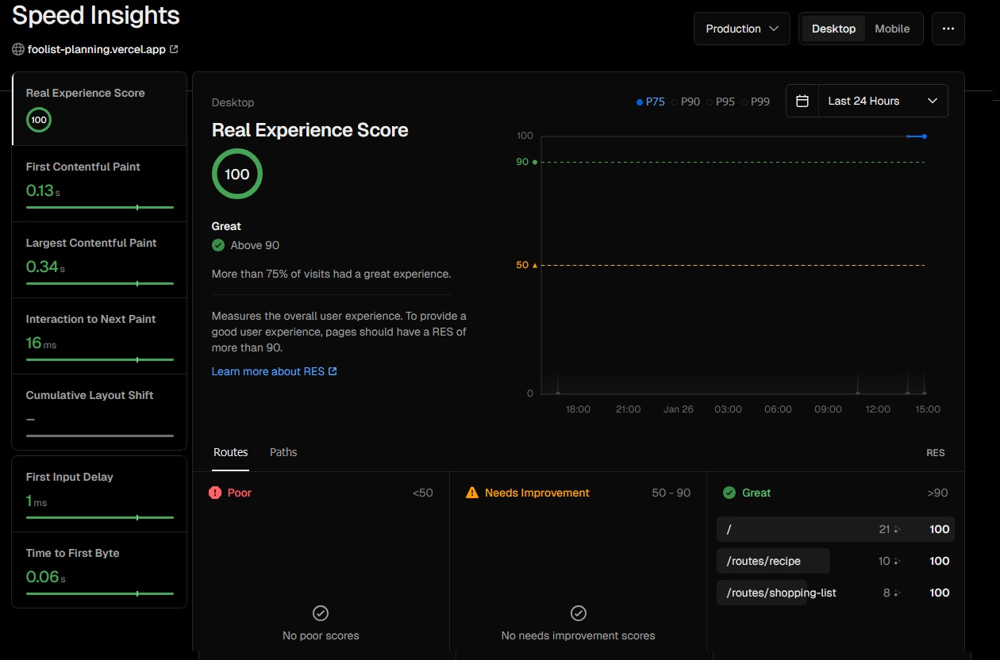

# FooList

Because this project was done for a CAS in Switzerland, that's why all the following documentation is in German.

## Installation

### pnpm installieren

Für die Applikation wurde `pnpm` als package manager verwendet. Falls `pnpm` nicht vorhanden ist, kann dies mit 
```
npm install -g pnpm@latest
```
gemacht werden. *Alternativ funktioniert im Normalfall auch einfach npm zu benutzen für installation + run*

### Dependencies installieren und starten

Sobald `pnpm` installiert ist sollten dependencies installiert werden mit

```
pnpm install-frozen
```

Zum starten kann danach

```
pnpm dev
```
ausgeführt werden. Die App wird Standardmässig auf [http://localhost:3000](http://localhost:3000) hosted

### Weitere wichtige Befehle
Code checks laufen lassen
```
pnpm checks
```

Automatische Linter Korrekturen
```
pnpm lint --fix
```

Unit test laufen lassen
```
pnpm lint --fix
```

Playwright tests im Hintergrund oder via UI
```
pnpm playwright
pnpm playwright-ui
```

# CAS Ergänzungen

## Last minute changes

Kurz vor der Abgabe wurden noch zwei wichtige Sachen geändert und ich hoffe es funktioniert jetzt alles korrekt, da die Zeit für intensive Tests nicht mehr vorhanden war.
- Shopping List wurden die Zutaten neu mit "Einheit" ausgegeben und werden nicht zusammen gefügt wenn die Einheit nicht auch die gleiche ist.
- Ein Fehler beim Erfassen von Rezepte wurden gefunden, bei welchen die Zutaten Änderungen und neue Zutaten nicht sauber erfasst wurden, dann passierte ein Folgefehler das ingredientId auf den analyzedIngredients undefined war, was Firebase nicht speichern kann.

## Speziell zu erwähnen

- Dokumentation zum durchgeführter Usability Test ist [hier](UXTEST.md) zu finden
- Playwright Test Happy Flow laufen lassen
  - pnpm playwright
  - pnpm playwright-ui (Um Test in Playwright UI anzuschauen)
- Unit Tests mit vitest
  - pnpm test
- Accessbility
  - Es wurde darauf geachtet, dass die ganze Applikation mit der Tastatur bedienbar ist.
  - Mit der Verwendung von shadcn Komponenten, welche Radix einsetzten sollte die Applikation relativ gute Accessibility auweisen. Radix folgt den WAI-ARIA guidelines. [See more](https://www.radix-ui.com/primitives/docs/overview/accessibility)
    - Die App wurde nie mit einem Screen Reader getestet, weshalb ich keine genaue Aussage zur effektiven Accessbility machen kann.
- Responsive Design
  - Die Applikation wurde mit dem mobile first Ansatz umgesetzt. Die vorhandene Tabelle zu den Zutaten könnte verbessert werden im Mobile Design.
  - Auf sehr schmalen Desktop Screens nimmt die Scrollbar das padding auf der rechten Seite ein. Mit 'device emulation' passiert dies nicht, deshalb wurden keine unterschiedlichen paddings für links und rechts benutzt.
- Next.js
  - Mit SSR wurde etwas experimentiert, davon hat aber kaum etwas überlebt. Ein Grund dafür war unter anderem auch Firebase, da man mit SSR noch Credentials in Cookies umwandeln müsste und diese an den Server schicken etc.
- Speedtests etc.
  - Google Lighthouse
    - Wurde auf der Route '/' laufen gelassen mit Performance, Accessibility, Best Practices und SEO mit jeweils 100
    - Wurde auf der Route '/routes/planning' laufen gelassen mit Accessibility, Best Practices und SEO mit jeweils 100 und Performance 93
    - Wurde auf der Route '/routes/recipe' laufen gelassen mit 99 Performance, 93 Accessibility, 100 Best Practices und 100 SEO
    - Wurde auf der Route '/routes/shopping-list' laufen gelassen mit Performance, Accessibility, Best Practices und SEO mit jeweils 100
  - Vercel Performance Insights
    - Vercel Performance Messung wird benutzt und hat folgendes Ergebniss:
    


## Funktion & Hintergrund

Die Grundidee der Applikation war es eine ganze Sammlung von "Rezeptkarten" am meinem Kühlschrank und andere gedruckte Rezepte (hauptsächlich aus einem vergangenen "Hello Fresh" Abo) in einer Applikation zu sammeln. Aus diesen Soll dann eine Rezeptplanung für die Woche gemacht werden können und eine Einkaufliste generiert werden.
(Aktuell werden die Rezeptkarten und Rezepte an ein Glas-Magnetboard gehängt und die Einkaufliste manuell erstellt.)

Der wichtigste Bestandteil eines Rezeptes sind die Zutaten (Kochanleitungen werden im Normalfall via Link auf eine andere Seite hinterlegt). Es war auch ein Image & PDF Upload geplant, dieser wurde während dem Projekt allerdings nicht umgesetzt, da die Applikation öffentlich sein sollte. Aufgrund von Sicherheitsbedenken wurden diese Funktionen aktuell weggelassen und werden später hinzugefügt, wenn die Applikation nur noch privat benutzt wird.

## Weiteres

Die aktuelle Implementation der Zutatenanalyse und die Führung der Zutaten auf der Datenbank ist keine wirklich gute Lösung. Hier müsste eine bessere Analyse (z.B. mit machine learning oder einer API) und eine grosse DB von existierenden Zutaten und Alias vorhanden sein und diese dürfte entweder gar nicht oder nur sehr beschränkt durch die User verändert werden können. Aktuell kann ein User über die Zutaten Veränderung theoretisch sehr viel kaputt machen für andere User.
APIs wurden zwar angeschaut aber auf die schnelle nichts genug simples und kostenloses gefunden was gut gepasst hat, weshalb eine einfache eigene Lösung implementiert wurde.

## Firebase

### Security

Firebase wird als Datenbank benutzt. Standard Einstellung betreffend der Auth Token Persistierung ist "browserLocalPersistence", welche auch benutzt wird. Dies ist im generellen nicht die beste Variante, wenn eine Applikation wirklich Sicher sein soll, da das Token viel zu lange vorhanden bleibt. Da hier nicht mit sensiblen Daten gearbeitet wird, wurde dies allerdings so belassen für die Benutzerfreundlichkeit.


### Firebase rules

```
rules_version = '2';

service cloud.firestore {
  match /databases/{database}/documents {

    // General rule for authenticated users (Temporary Test Rule)
    match /{document=**} {
      allow read, write: if request.auth != null; // Allows access for authenticated users
    }

		match /users/{userId} {
      allow read, write: if request.auth != null && request.auth.uid == userId;
    }
    
    match /recipes/{recipeId} {
      // Allow read access only if:
      // - Recipe is public (`isPrivate == false`), or
      // - Recipe is private (`isPrivate == true`) and the user is the owner (`ownerId == request.auth.uid`)
      allow read: if resource.data.isPrivate == false || 
                  (resource.data.isPrivate == true && resource.data.ownerId == request.auth.uid);

      // Allow write access only for the owner of the recipe
      allow write: if request.auth != null && resource.data.ownerId == request.auth.uid;
    }
  }
}
```

## Begründung nicht funktionsfähige Elemente, welche  in der Applikation gelassen wurden

### Upload Bild & PDF
Dies wurde extra in der Applikation gelassen, da diese, wie weiter oben bereits beschrieben, hauptsächlich aus Sicherheitsgründen weggelassen wurden, solange die Applikation noch öffentlich zugänglich ist. 

### Diverse loading & error states
Wie im folgenden Abschnitt *Next Steps* beschrieben sollte als nächstes Fehlerhandling & verbessertes Loading States angegangen werden, weshalb loading und error states bei den meisten Hooks & Pages nicht gelöscht wurden auch wenn sie nicht benutzt werden. Ursprünglich wollte ich dies natürlich einbauen, bin allerdings leider nicht mehr dazu gekommen.


## Next Steps

Um die Applikation öffentlich zu publishen, müssten folgende Punkte gemacht bzw. verbessert werden
- Zutatenanalyse müsste mit AI oder ähnlichem gemacht werden und die Liste dürfte nicht direkt durch den Benutzer editierbar sein
- Fehlerhandling und Loading States müssten verbessert werden
  - Loading State mit z.B. Skeleton Loader
  - Fehlerhandling mit Toast und kein Abbruch von Formularen onError
- Das laden der Rezpte müsste mit einer "Paging" Logik umgesetzt werden.
- Visuell etwas aufhübschen und Komponenten von shadcn auf einen eigenen Stil style

# Entwicklung

## shadcn Komponente hinzufügen

Eine neue shadcn Komponente hinzufügen mit:
```
pnpm dlx shadcn@latest add xxx
```
[Komponenten](https://ui.shadcn.com/docs/components/)